## Detectron2 API

API that receives images, analyses them using Detectron2 and gives images back annotated including masks for all objects detected

Code adapted from:
* [Enric Moreu's Human Mask Generator API](https://github.com/enric1994/detectron-api)
* [Facebook's Detectron2](https://github.com/facebookresearch/detectron2)

## Technologies

* [Flask](http://flask.pocoo.org/)
* [Docker](https://www.docker.com/)

## Deployment

1. From the `docker` folder run: `docker-compose up -d` . You can check the status of the container with: `docker ps -a`. You can also see what's going on inside the container with `docker logs dazcona_express_human-mask-api -f`. Then, either as the command to be run by the container on start-up or manually, you have to start the Flask development server:
```
$ cd docker
$ docker exec -it dazcona_express_human-mask-api bash
# python3 src/app.py
```

2. On the main folder run: `python3 send_file.py` to send one or more images. A list of images will be generated based on the objects detected by Detectron2 including masks and annotations. These images will be stored in `figures/responses/`
```
# python3 send_file.py
```

## Example

### Input

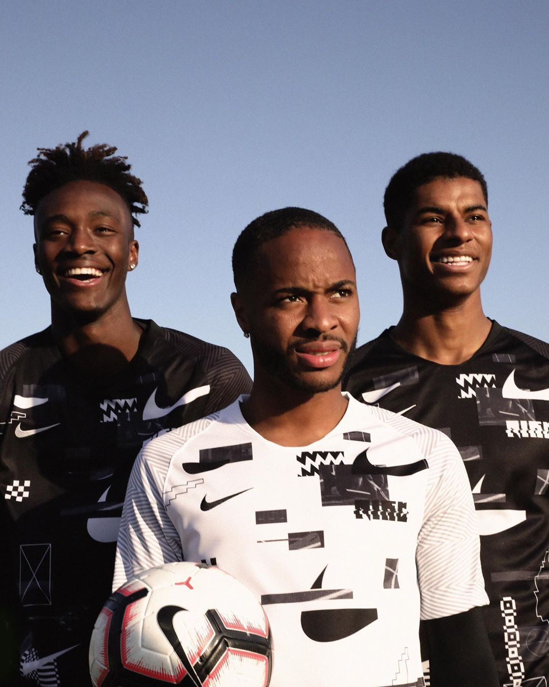

### Output

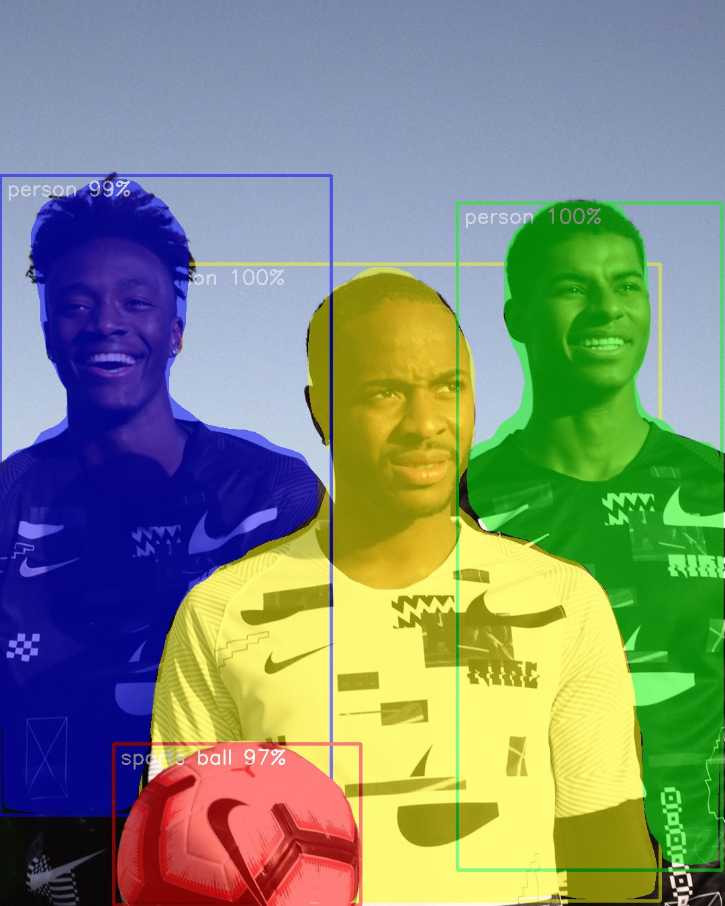

| 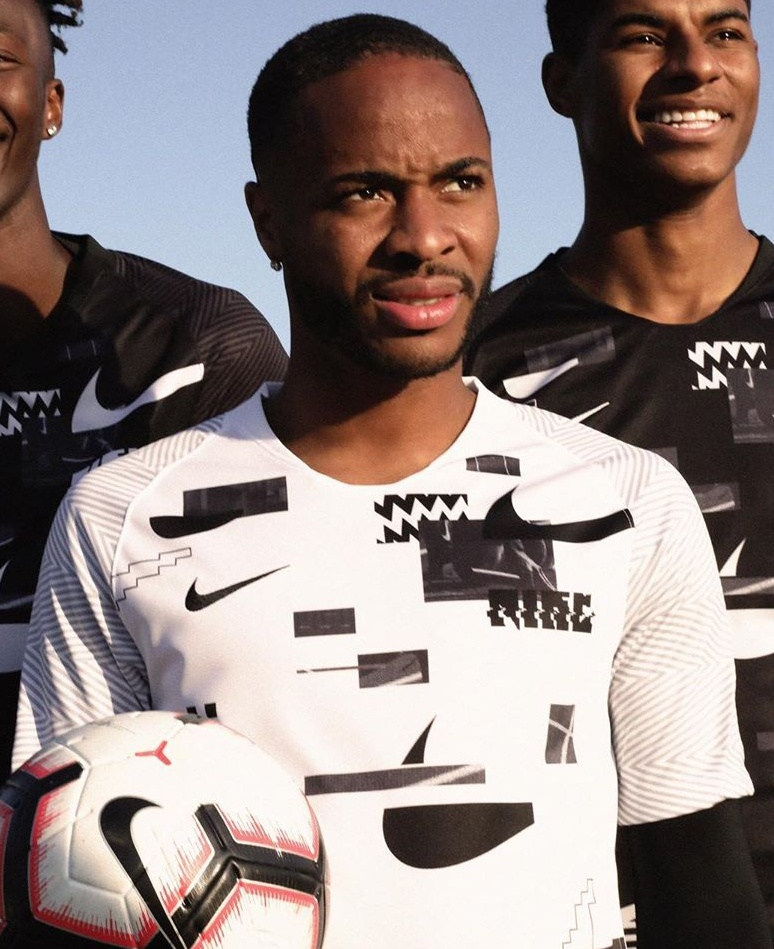 | 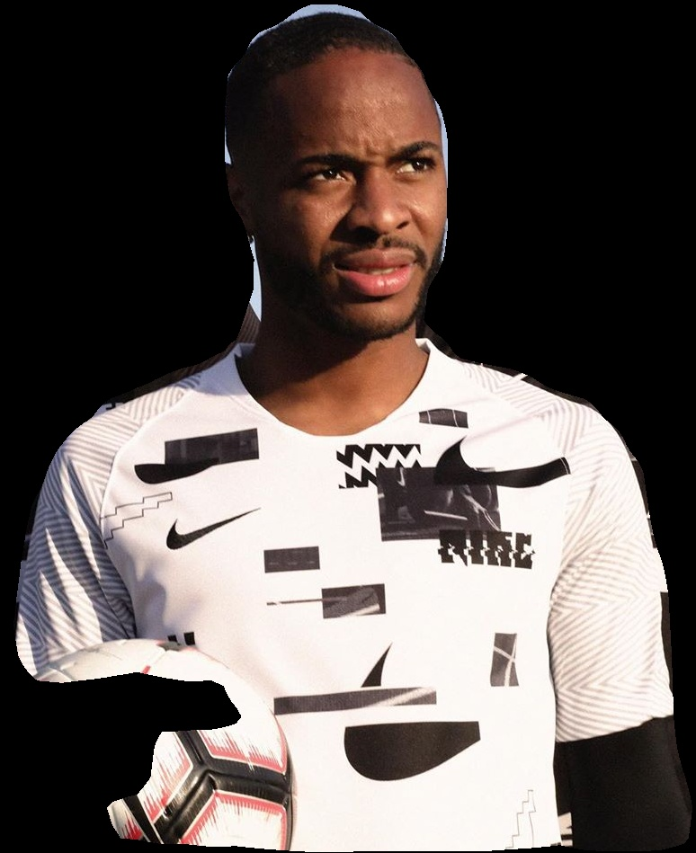 |  | 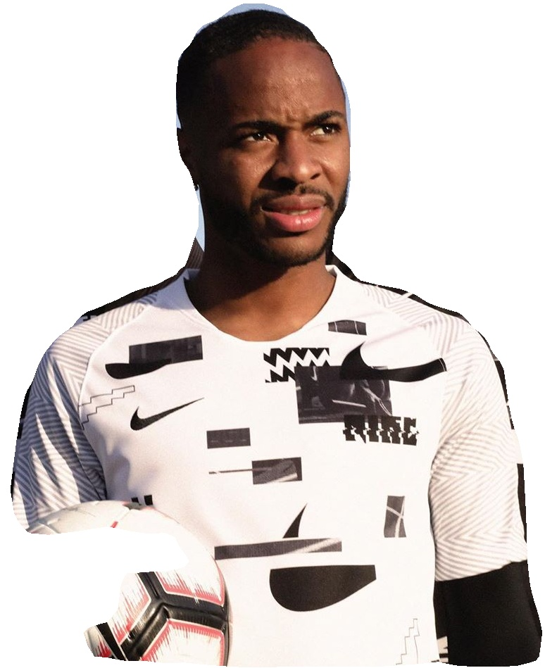 |  |
| :-------------: | :-------------: | :-------------: | :-------------: | :-------------: |
|  | 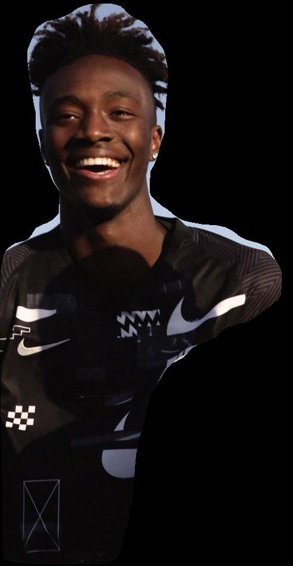 | 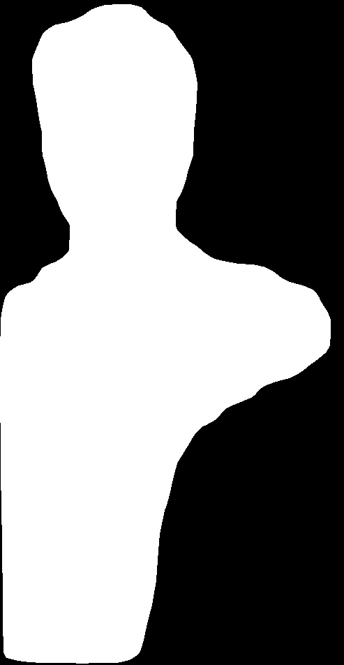 | 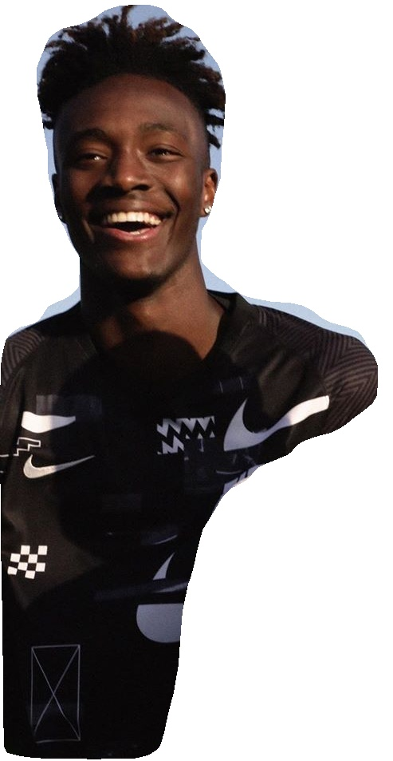 | 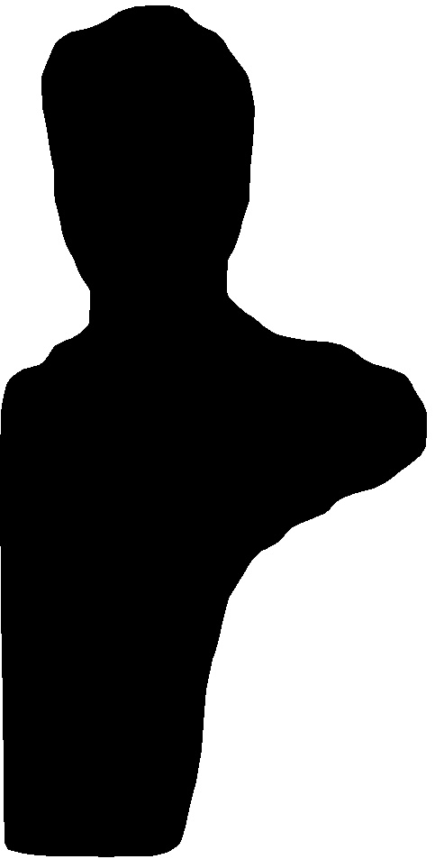 |
| 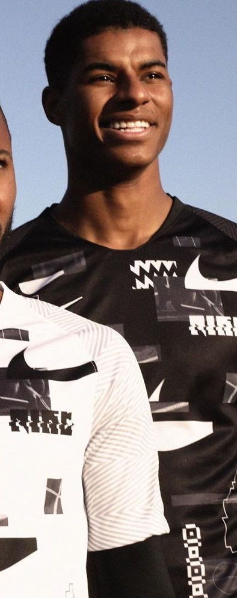 | 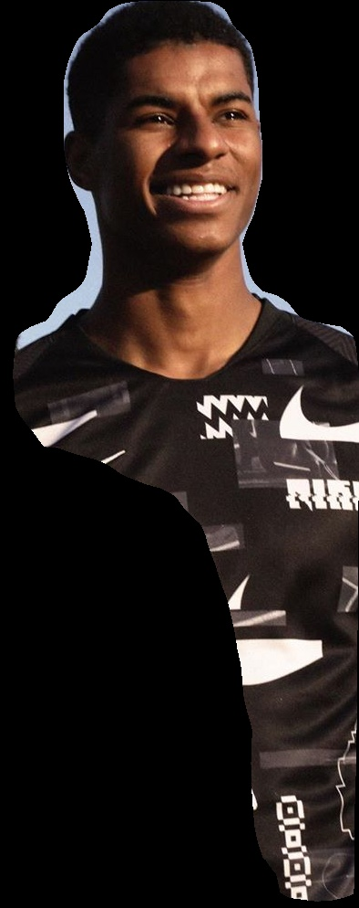 | 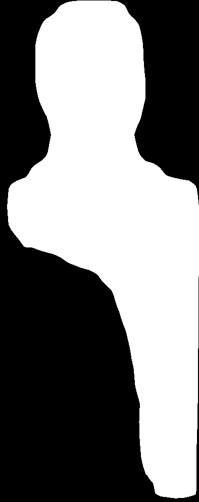 | 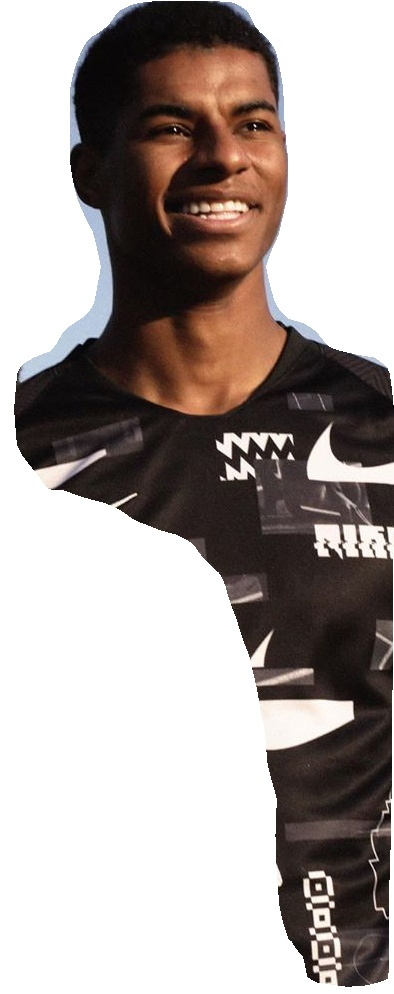 | 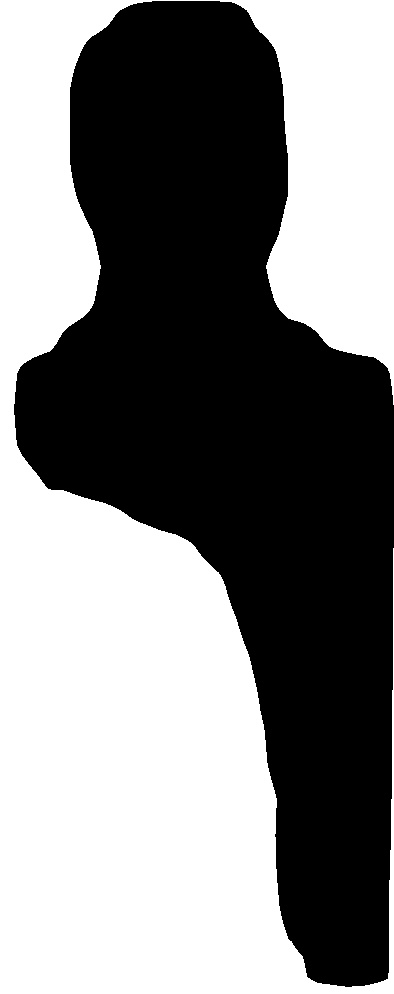 |
| 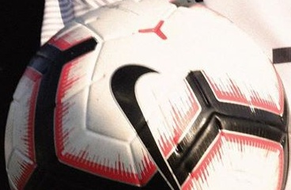 | 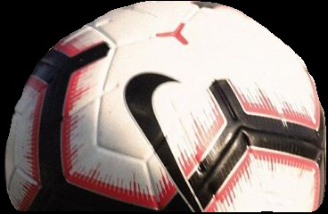 | 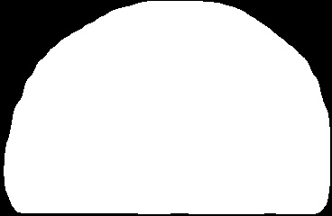 | 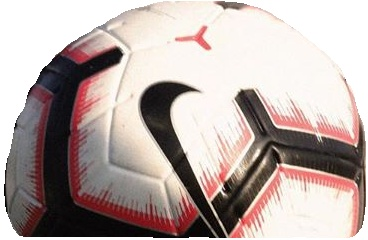 | 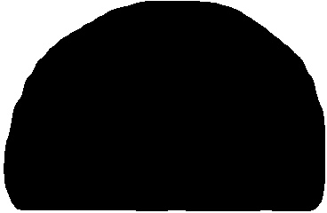 |

